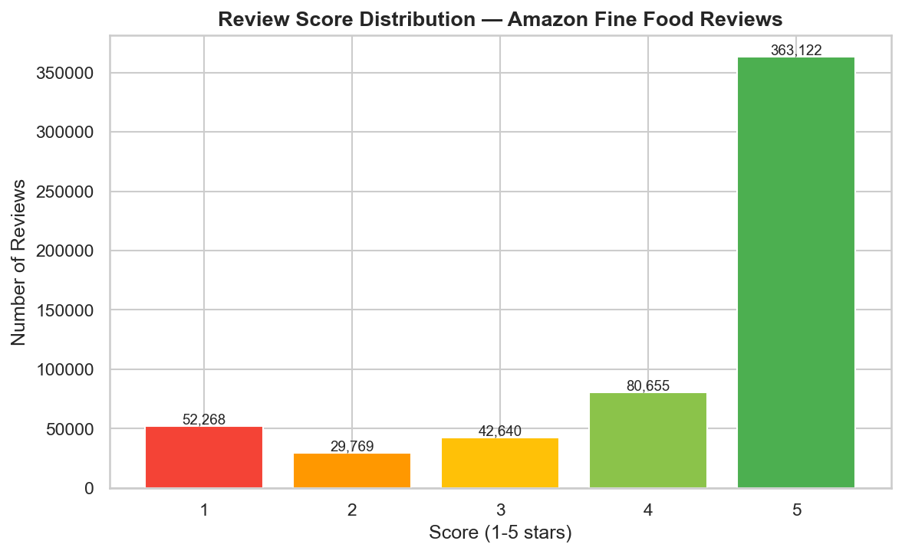
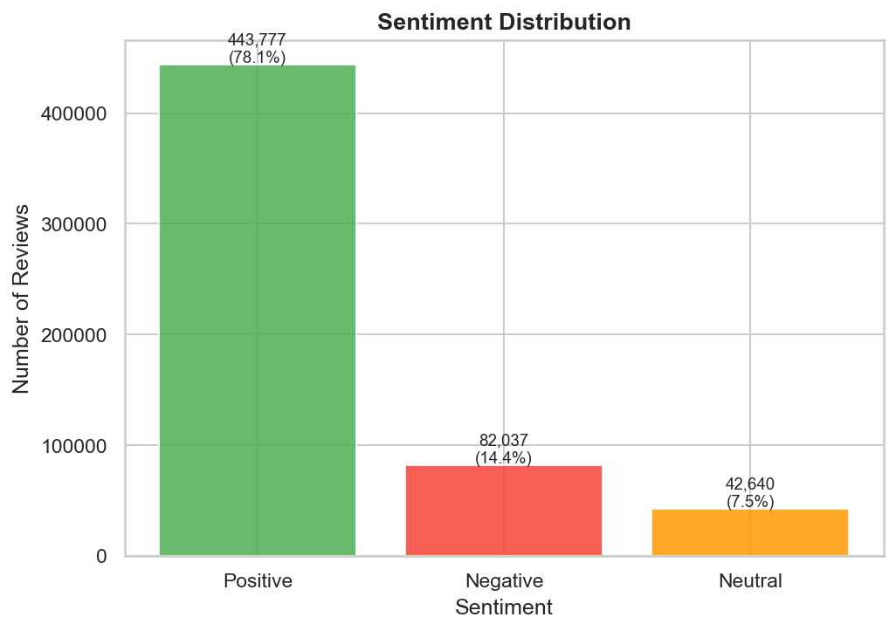
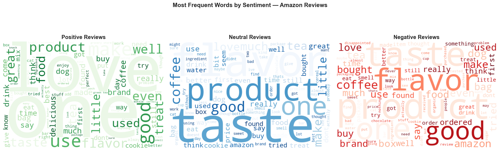
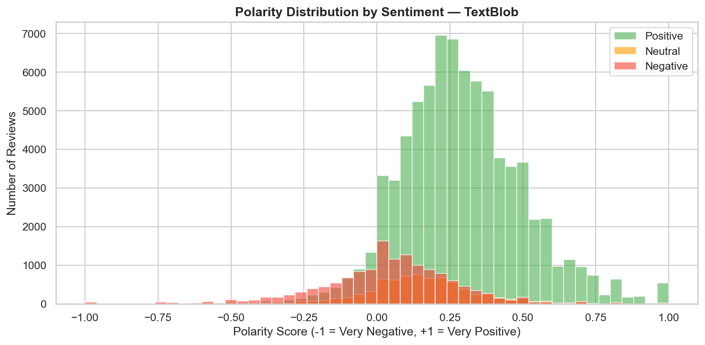
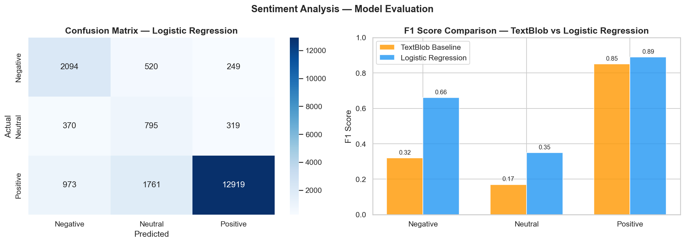
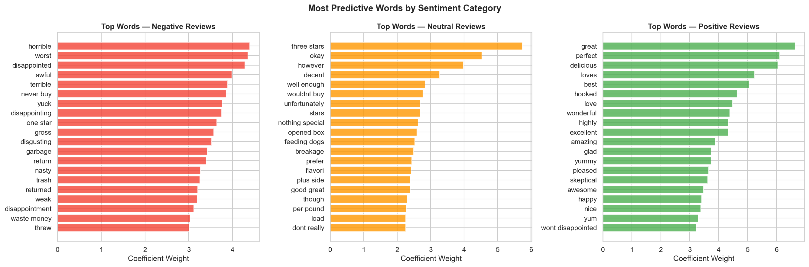
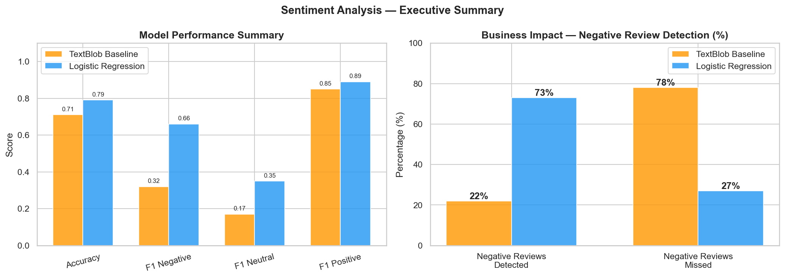

# 🔍 Customer Sentiment Analysis — Amazon Reviews

> **End-to-end NLP project analyzing 568,000+ real Amazon reviews — combining TextBlob baseline, TF-IDF vectorization, and Logistic Regression to classify customer sentiment and surface actionable business insights.**

[](https://python.org)
[](https://scikit-learn.org)
[](https://www.nltk.org)
[](https://textblob.readthedocs.io)
[]()

---

## 🧠 The Business Problem

Every e-commerce company receives thousands of customer reviews every month. Reading them manually is impossible at scale. Without an automated system to classify them, product and operations teams are flying blind — unable to distinguish isolated complaints from systemic issues that require immediate action.

The critical question:

> *What are customers actually saying — and which problems repeat often enough to justify a corrective action?*

This project builds an automated sentiment classification pipeline that processes customer reviews at scale, identifies the key drivers of dissatisfaction, and translates model output into concrete business recommendations.

---

## ✅ The Solution

An end-to-end NLP pipeline that cleans and preprocesses raw review text, evaluates a rule-based baseline (TextBlob), trains a supervised classification model (TF-IDF + Logistic Regression), and surfaces the most predictive words driving each sentiment category.

> *The supervised model detects 73% of negative reviews — more than 3x the 22% detection rate of the TextBlob baseline — giving operations teams a reliable signal to act on customer dissatisfaction before it escalates.*

---

## 📐 Architecture Overview

```
┌─────────────────────┐    ┌──────────────────────┐    ┌──────────────────────┐
│  568K Amazon        │───▶│  Text Preprocessing  │───▶│  TextBlob Baseline   │
│  Food Reviews       │    │  NLTK · Stopwords    │    │  Polarity Analysis   │
└─────────────────────┘    └──────────────────────┘    └──────────┬───────────┘
                                                                    │
                                              ┌─────────────────────▼──────────┐
                                              │  TF-IDF + Logistic Regression  │
                                              │  Supervised Classification      │
                                              │  Business Insights & WordCloud  │
                                              └────────────────────────────────┘
```

---

## 🔄 Methodology — STAR Framework

### Situation
An e-commerce platform with 568,000+ customer reviews had no automated system to classify sentiment at scale. Manual review was impossible, and critical dissatisfaction signals — hidden in negative reviews — were going undetected, impacting product quality decisions and brand reputation.

### Task
Build an NLP pipeline that:
- Preprocesses raw review text at scale
- Evaluates a rule-based baseline and identifies its limitations
- Trains a supervised model that outperforms the baseline on negative review detection
- Identifies the key words and themes driving each sentiment category
- Delivers actionable business insights from the model output

### Action

**1 — Exploratory Analysis**
- Analyzed 568,454 reviews — average score 4.18, strong positive skew (78% positive)
- Identified critical imbalance: 1-star reviews (52K) outnumber 2-star reviews (29K) — highly dissatisfied customers are more vocal than moderately dissatisfied ones
- Created sentiment labels: Positive (4-5★), Neutral (3★), Negative (1-2★)

**2 — Text Preprocessing (NLTK)**
- Removed HTML tags, special characters, and punctuation
- Converted to lowercase and removed English stopwords
- Processed 100,000 reviews for modeling — sufficient for robust training

**3 — WordCloud Analysis**
- Visualized most frequent words by sentiment category
- Key finding: negative reviews cluster around "horrible", "worst", "disappointed", "waste money", "return" — indicating post-purchase expectation mismatch
- Neutral reviews show ambivalent language: "okay", "decent", "however", "nothing special"

**4 — TextBlob Baseline**
- Applied rule-based sentiment scoring (polarity -1 to +1)
- Result: 71% accuracy but only 22% recall on negative reviews — 78% of complaints go undetected

**5 — Supervised Model: TF-IDF + Logistic Regression**

| Metric | TextBlob Baseline | Logistic Regression |
|--------|------------------|---------------------|
| Accuracy | 71% | **79%** |
| F1 Negative | 0.32 | **0.66** |
| F1 Neutral | 0.17 | **0.35** |
| F1 Positive | 0.85 | **0.89** |

TF-IDF with 10,000 features and bigrams (ngram_range 1-2), combined with class balancing, more than doubled negative review detection from 22% to 73%.

### Results

**Key Result #1:** The supervised model achieves 79% accuracy and detects 73% of negative reviews — compared to 22% with TextBlob. For every 1,000 complaints, the model correctly flags 730 vs 220 with the baseline.

**Key Result #2:** Top negative predictors — "horrible", "worst", "disappointed", "never buy", "waste money", "return" — reveal that dissatisfied customers are not just unhappy, they are actively warning others not to buy.

**Key Result #3:** "Waste money" and "return" appearing among top negative words indicates that price-quality mismatch and return friction are systemic issues, not isolated incidents.

---

## 📊 Analysis & Visualizations

**Review score and sentiment distribution:**





**Most frequent words by sentiment — WordCloud analysis:**



**TextBlob polarity distribution by sentiment:**



**Model evaluation — Confusion Matrix and F1 comparison:**



**Most predictive words per sentiment category:**



**Executive summary — model performance and business impact:**



---

## 🔍 Key Business Insights

| Insight | Recommended Action |
|---------|-------------------|
| 73% of negative reviews correctly detected (vs 22% baseline) | Deploy model to flag negative reviews for immediate product team review |
| "Waste money" and "return" are top negative predictors | Investigate price-quality perception and return process friction |
| "Never buy" signals customers actively discouraging others | Monitor and respond publicly to these reviews to protect brand reputation |
| 1-star reviews outnumber 2-star — dissatisfaction is polarized | Prioritize resolution of 1-star reviews — they have highest churn and referral risk |
| Neutral reviews use "however" and "unfortunately" — near misses | Small quality improvements could convert neutral customers to promoters |

---

## 🛠️ Tech Stack

| Layer | Technology | Purpose |
|-------|------------|---------|
| Data Source | Kaggle — Amazon Fine Food Reviews | 568,454 real customer reviews |
| Preprocessing | Python · NLTK · Regex | Text cleaning, stopword removal |
| Baseline | TextBlob | Rule-based sentiment scoring |
| Visualization | WordCloud · Matplotlib · Seaborn | Sentiment patterns and word frequency |
| Modeling | scikit-learn · TfidfVectorizer · LogisticRegression | Supervised sentiment classification |
| Evaluation | Accuracy · Precision · Recall · F1 · Confusion Matrix | Business-oriented model assessment |
| Environment | Jupyter Notebook | Full reproducible pipeline |

---

## 📁 Repository Structure

```
sentiment-analysis/
│
├── notebooks/
│   └── 01_sentiment_analysis.ipynb   # Full pipeline: EDA, preprocessing, modeling, evaluation
├── data/
│   └── Reviews.csv                   # Not included — see Dataset section below
├── img/
│   ├── score_distribution.png        # Rating distribution 1-5 stars
│   ├── sentiment_distribution.png    # Positive · Neutral · Negative split
│   ├── wordclouds.png                # Most frequent words by sentiment
│   ├── polarity_distribution.png     # TextBlob baseline analysis
│   ├── model_evaluation.png          # Confusion matrix + F1 comparison
│   ├── top_words_by_sentiment.png    # Most predictive words per category
│   └── executive_summary.png        # Business impact summary
├── requirements.txt                  # Python dependencies
└── LICENSE                           # MIT License
```

---

## 📊 Dataset

This project uses the **Amazon Fine Food Reviews** dataset, available on [Kaggle](https://www.kaggle.com/datasets/snap/amazon-fine-food-reviews).

To run the notebook locally:
1. Download `Reviews.csv` from the link above
2. Place it in the `data/` folder
3. Run the notebook

The dataset contains 568,454 real food product reviews from Amazon, including rating score (1-5) and full review text.

---

## 👤 Author

**Andrés Navarro**
Data Analyst · NLP · Machine Learning · Python

[](https://github.com/AndyNavarro77)
[](https://www.linkedin.com/in/andr%C3%A9s-navarro77/)
[](https://andres-navarro-portfolio.netlify.app/)

---

*Built to demonstrate end-to-end NLP thinking — from raw text preprocessing to supervised classification — translating model output into actionable business intelligence across a dataset of 568,000+ real customer reviews.*